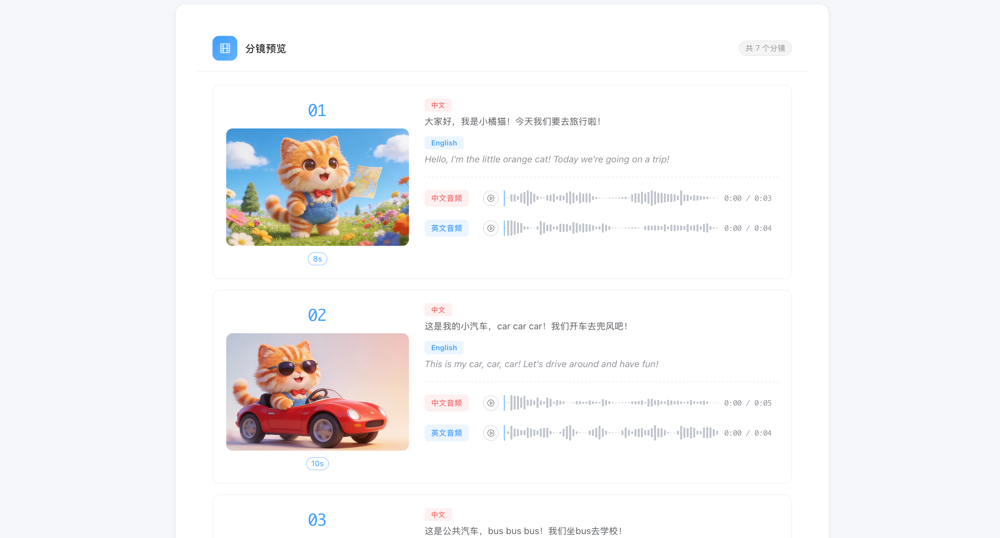
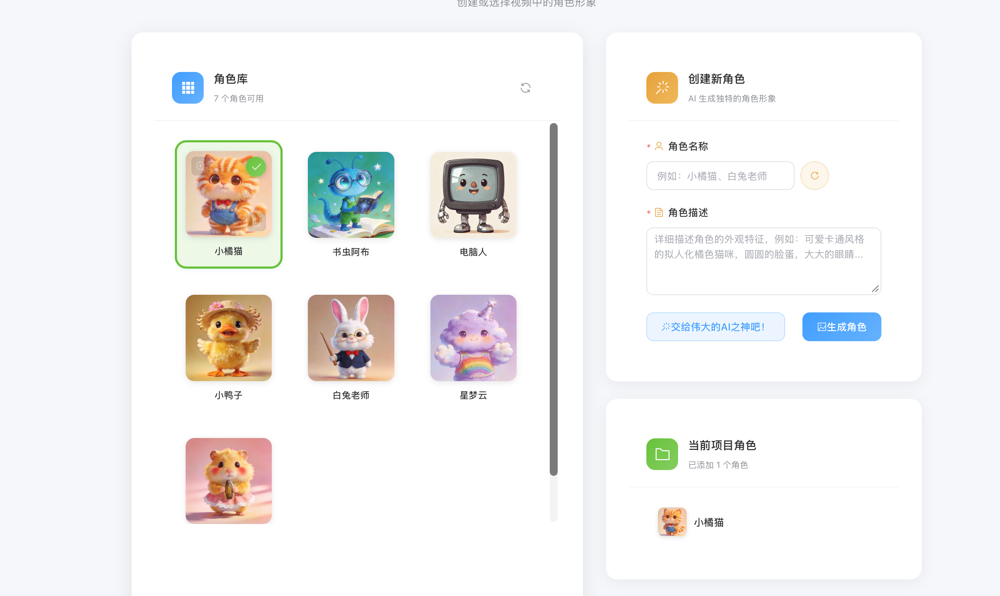
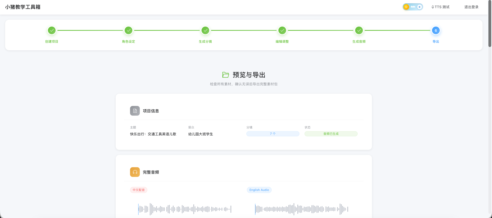

# Piggy Teaching Toolbox (小猪教学工具箱)

基于 AI 的教学视频素材自动生成工具。通过自然语言输入教学主题，AI 自动完成分镜脚本编写、角色设计、场景图片生成、中英文配音、字幕制作，最终打包导出全部素材。采用 Vue 3 + FastAPI 前后端分离架构，支持 Docker 一键部署。

## 目录

- [功能特点](#功能特点)
- [界面预览](#界面预览)
- [系统架构](#系统架构)
- [技术栈](#技术栈)
- [项目结构](#项目结构)
- [环境准备](#环境准备)
- [数据库初始化](#数据库初始化)
- [本地开发部署](#本地开发部署)
- [Docker 一键部署](#docker-一键部署)
- [远程服务器部署](#远程服务器部署)
- [SCF 云函数配置（ZIP 导出）](#scf-云函数配置zip-导出)
- [环境变量说明](#环境变量说明)
- [API 接口文档](#api-接口文档)
- [使用指南](#使用指南)
- [默认账号](#默认账号)
- [开发与测试](#开发与测试)
- [License](#license)

---

## 功能特点

- **AI 分镜生成** — 输入教学主题和受众，AI 自动生成完整分镜脚本（含中英文旁白、图片描述、视频运镜描述）
- **角色一致性** — 使用 AI 图片生成保持视频中角色形象的一致性，支持角色库管理
- **双语配音** — 自动生成中英文配音，支持 17 种情感、语速/音量/情感强度调节
- **双语字幕** — 自动生成 SRT 格式中英文字幕文件
- **断点续传** — 所有中间状态持久化到 MySQL，支持从任意阶段恢复
- **多风格模板** — 内置教学、儿歌、读绘本/故事、朗诵 4 种预设风格 + 自定义风格
- **智能音频参数** — 分镜生成时自动推荐情感和音频参数，支持手动调整
- **向导式界面** — 6 步向导引导完成素材创作
- **云端存储** — 腾讯云 COS 存储图片和音频，SCF 云函数打包导出
- **任务队列** — 异步任务管理，支持进度查询和状态追踪

---

## 界面预览

### 分镜预览
AI 生成的分镜展示，包含角色图片、中英文旁白、音频波形预览：



### 角色库
丰富的角色库，支持从预设角色选择或 AI 生成新角色：



### 预览与导出
完整的项目预览页面，展示项目信息、音频素材，支持一键导出：



---

## 系统架构

```
┌──────────────────────────────────────────────────────────────┐
│                Frontend (Vue 3 + Element Plus)                │
│   ┌──────────┐ ┌──────────┐ ┌──────────┐ ┌──────────┐        │
│   │  Login   │ │ Step 1-6 │ │  Stores  │ │  Router  │        │
│   └────┬─────┘ └────┬─────┘ └────┬─────┘ └────┬─────┘        │
│        └────────────┴────────────┴────────────┘               │
│                      │ Axios / HTTP                           │
└──────────────────────┼───────────────────────────────────────┘
                       │
┌──────────────────────┼───────────────────────────────────────┐
│                Backend (FastAPI + Python 3.11)                │
│   ┌────────────────────────────────────────────────────┐     │
│   │                   API Layer                         │     │
│   │  /auth  /projects  /characters  /tasks  /voices    │     │
│   │  /storyboard  /audio  /export  /styles  /emotions  │     │
│   └───────────────────────┬────────────────────────────┘     │
│                           │                                   │
│   ┌───────────────────────┼────────────────────────────┐     │
│   │              Service / Core Layer                   │     │
│   │  Orchestrator  TaskQueue  StyleTemplates            │     │
│   │  ScriptPlanner  SceneGenerator  AudioGenerator      │     │
│   │  CharacterGenerator  SubtitleGenerator              │     │
│   │  AssetExporter  StorageManager  COSClient           │     │
│   └───────────────────────┬────────────────────────────┘     │
└───────────────────────────┼───────────────────────────────────┘
                            │
         ┌──────────────────┼──────────────────┐
         │                  │                  │
   ┌─────┴─────┐    ┌───────┴───────┐  ┌──────┴──────┐
   │  MySQL    │    │  Tencent COS  │  │  AI Services │
   │  8.0      │    │  (Storage)    │  │              │
   │           │    │               │  │ • DashScope  │
   │ • users   │    │ • Images      │  │   (qwen3)    │
   │ • projects│    │ • Audios      │  │ • ARK        │
   │ • scenes  │    │ • Exports     │  │   (Seedream) │
   │ • chars   │    │               │  │ • IndexTTS-2 │
   │ • voices  │    │               │  │              │
   └───────────┘    └───────────────┘  └─────────────┘
```

---

## 技术栈

### 后端

| 技术 | 版本 | 用途 |
|------|------|------|
| Python | 3.11+ | 运行环境 |
| FastAPI | ≥0.115 | Web 框架 |
| Uvicorn | ≥0.32 | ASGI 服务器 |
| SQLAlchemy | ≥2.0 | ORM |
| PyMySQL | ≥1.1 | MySQL 驱动 |
| LangChain | ≥0.3 | AI 工作流编排 |
| Pydantic | ≥2.0 | 数据校验 |
| PyJWT | ≥2.10 | 认证令牌 |
| cos-python-sdk-v5 | ≥1.9 | 腾讯云 COS SDK |

### 前端

| 技术 | 版本 | 用途 |
|------|------|------|
| Vue | 3.5+ | 前端框架 |
| Vite | 7.2+ | 构建工具 |
| Element Plus | 2.13+ | UI 组件库 |
| Pinia | 3.0+ | 状态管理 |
| Vue Router | 4.6+ | 路由管理 |
| Axios | 1.13+ | HTTP 请求 |
| Wavesurfer.js | 7.12+ | 音频波形可视化 |

### 基础设施

| 技术 | 用途 |
|------|------|
| MySQL 8.0 | 关系型数据库 |
| Docker / Docker Compose | 容器化部署 |
| Nginx | 前端静态资源服务 + API 反向代理 |
| 腾讯云 COS | 对象存储（图片、音频） |
| 腾讯云 SCF | Serverless 云函数（ZIP 打包导出） |

### AI 服务

| 服务 | 模型 | 用途 |
|------|------|------|
| 阿里云 DashScope | qwen3-max | 文本生成（分镜脚本、旁白） |
| 阿里云 DashScope | wan2.6-t2i | 角色图片生成 |
| 火山引擎方舟 (ARK) | doubao-seedream-4-5 | 场景图片生成（文生图） |
| UCloud Modelverse | IndexTTS-2 | 语音合成（中英文 TTS） |

---

## 项目结构

```
piggy-teaching-toolbox/
├── backend/                        # Python 后端
│   ├── api/                        # API 层
│   │   ├── main.py                 # FastAPI 应用入口
│   │   ├── dependencies.py         # 依赖注入（认证等）
│   │   ├── errors.py              # 统一异常处理
│   │   ├── validators.py          # 请求参数校验
│   │   └── routes/                # 路由模块
│   │       ├── auth.py            # 认证（登录/登出）
│   │       ├── projects.py        # 项目管理
│   │       ├── characters.py      # 角色管理
│   │       ├── storyboard.py      # 分镜生成
│   │       ├── audio.py           # 音频生成 & 音色管理
│   │       ├── export.py          # 素材导出
│   │       ├── tts.py             # TTS 测试
│   │       ├── styles.py          # 风格列表
│   │       └── emotions.py        # 情感列表
│   ├── config.py                  # 配置管理（Pydantic Settings）
│   ├── core/                      # 核心业务逻辑
│   │   ├── orchestrator.py        # 工作流编排器
│   │   ├── script_planner.py      # 分镜脚本生成
│   │   ├── retry.py               # 重试机制
│   │   ├── style_templates.py     # 风格模板管理
│   │   ├── asset_exporter.py      # 素材打包导出
│   │   └── generators/            # 各类生成器
│   │       ├── scene.py           # 场景图片生成
│   │       ├── audio.py           # 音频生成
│   │       ├── character.py       # 角色图片生成
│   │       └── subtitle.py        # 字幕生成
│   ├── db/                        # 数据库层
│   │   ├── models.py              # ORM 模型 & 数据库配置
│   │   └── crud/                  # 数据访问层
│   │       └── projects.py        # 项目 CRUD
│   ├── schemas/                   # Pydantic 数据模型
│   │   └── models.py              # 请求/响应模型
│   └── services/                  # 服务层
│       ├── tasks.py               # 异步任务队列
│       ├── storage.py             # 项目存储管理
│       └── cos_client.py          # 腾讯云 COS 客户端
├── frontend/                      # Vue 3 前端
│   ├── src/
│   │   ├── api/                   # API 请求封装（Axios）
│   │   ├── components/            # 通用组件
│   │   ├── views/                 # 页面视图
│   │   │   ├── Login.vue          # 登录页
│   │   │   ├── Home.vue           # 首页/项目列表
│   │   │   ├── StepCreate.vue     # 步骤1：创建项目
│   │   │   ├── StepCharacter.vue  # 步骤2：角色设定
│   │   │   ├── StepStoryboard.vue # 步骤3：生成分镜
│   │   │   ├── StepEdit.vue       # 步骤4：编辑调整
│   │   │   ├── StepAudio.vue      # 步骤5：生成音频
│   │   │   ├── StepExport.vue     # 步骤6：导出素材
│   │   │   └── TTSTest.vue        # TTS 测试页
│   │   ├── stores/                # Pinia 状态管理
│   │   ├── router/                # 路由配置
│   │   └── main.ts                # 应用入口
│   ├── Dockerfile                 # 前端容器构建（多阶段）
│   ├── nginx.conf                 # Nginx 配置
│   └── package.json
├── docker/
│   └── mysql/init/                # MySQL 初始化 SQL
│       ├── 01-init.sql            # 数据库创建脚本
│       └── styles.sql             # 风格字段迁移脚本
├── scripts/                       # 运维脚本
│   ├── init_db.py                 # 数据库初始化脚本
│   ├── add_user.py                # 添加用户脚本
│   ├── start_dev.sh               # 开发环境启动脚本
│   ├── docker-deploy.sh           # Docker 部署管理脚本
│   ├── deploy-remote.sh           # 远程服务器部署脚本
│   └── scf_zip_exporter/          # SCF 云函数（ZIP 导出）
├── tests/                         # 测试文件
├── docker-compose.yml             # 生产环境 Docker Compose
├── docker-compose.dev.yml         # 开发环境 Docker Compose（仅 MySQL）
├── Dockerfile                     # 后端容器构建
├── requirements.txt               # Python 依赖
├── pyproject.toml                 # Poetry 项目配置
├── .env.example                   # 环境变量模板
└── README.md
```

---

## 环境准备

### 前置要求

- **Docker** ≥ 20.10（推荐使用 Docker Desktop）
- **Docker Compose** ≥ 2.0
- **Python** ≥ 3.11（本地开发）
- **Node.js** ≥ 20（本地开发）
- **MySQL** ≥ 8.0（本地开发可不单独安装，使用 Docker）

### 获取 AI 服务 API Key

| 服务 | 获取方式 |
|------|----------|
| 阿里云 DashScope | [控制台](https://dashscope.console.aliyun.com/) → API-KEY 管理 |
| 火山引擎方舟 (ARK) | [控制台](https://console.volcengine.com/ark) → API Key 管理 |
| UCloud IndexTTS | [Modelverse 控制台](https://console.ucloud.cn/modelverse) → API Key |

### 获取腾讯云 COS 配置

1. 登录 [腾讯云 COS 控制台](https://console.cloud.tencent.com/cos)
2. 创建存储桶（推荐地域：ap-guangzhou）
3. 获取 SecretId / SecretKey：[API 密钥管理](https://console.cloud.tencent.com/cam/capi)

---

## 数据库初始化

项目使用 MySQL 8.0 作为数据库，包含以下 6 张表：

| 表名 | 说明 |
|------|------|
| `users` | 用户表（用户名、密码哈希、邮箱、管理员标志） |
| `projects` | 项目表（教学主题、风格、状态、音频/导出 URL） |
| `scenes` | 分镜表（旁白、图片 URL、音频 URL、音频参数） |
| `characters` | 角色库表（角色 ID、名称、图片 URL） |
| `voices` | 音色表（音色 ID、COS URL） |
| `project_characters` | 项目-角色关联表 |

### 方式一：Docker 部署时自动初始化（推荐）

使用 `docker-compose.yml` 部署时，`db-init` 服务会自动执行初始化：

```bash
# 启动所有服务（包含数据库初始化）
./scripts/docker-deploy.sh up
```

此命令会依次执行：
1. 启动 MySQL 容器并等待健康检查通过
2. 运行 `db-init` 容器执行 `scripts/init_db.py`
3. 创建数据库 `video_generator`
4. 创建所有 6 张表
5. 创建默认管理员账号

### 方式二：手动初始化（本地开发）

```bash
# 1. 启动 MySQL 容器（仅数据库）
docker-compose -f docker-compose.dev.yml up -d

# 2. 等待 MySQL 就绪（约 10-30 秒）
docker-compose -f docker-compose.dev.yml ps  # 确认状态为 healthy

# 3. 运行初始化脚本
python scripts/init_db.py
```

初始化脚本执行流程：

```
[1/3] Checking database...      ← 检查/创建数据库
[2/3] Creating tables...        ← 创建所有数据表
[3/3] Creating default admin... ← 创建管理员账号
```

### 数据库初始化脚本说明

`scripts/init_db.py` 做了以下工作：

1. **创建数据库**：如果 `video_generator` 数据库不存在则创建（UTF-8 编码）
2. **创建数据表**：通过 SQLAlchemy `Base.metadata.create_all()` 自动建表
3. **创建管理员**：读取 `.env` 中的 `ADMIN_USERNAME` / `ADMIN_PASSWORD` 创建管理员账号

### 手动添加用户

```bash
# 添加普通用户
python scripts/add_user.py <用户名> <密码>

# 添加管理员用户
python scripts/add_user.py <用户名> <密码> --admin
```

### MySQL 初始化 SQL 文件

`docker/mysql/init/` 目录下的 SQL 文件会在 MySQL 容器首次启动时自动执行：

- `01-init.sql` — 创建数据库并授权
- `styles.sql` — 风格字段迁移脚本（如需从旧版升级手动执行）

---

## 本地开发部署

适合开发调试，支持前后端热重载。

### 第一步：配置环境变量

```bash
# 复制环境变量模板
cp .env.example .env

# 编辑 .env 文件，填入你的 API Keys 和数据库配置
vim .env
```

`.env` 文件需要配置的关键项：

```env
# AI 服务
DASHSCOPE_API_KEY=sk-your-dashscope-api-key
ARK_API_KEY=your-ark-api-key
INDEXTTS_API_KEY=your-indextts-api-key

# 数据库（本地开发使用 localhost）
DB_HOST=localhost
DB_PORT=3306
DB_USER=root
DB_PASSWORD=your_password
DB_DATABASE=video_generator

# 腾讯云 COS
COS_SECRET_ID=your_cos_secret_id
COS_SECRET_KEY=your_cos_secret_key
COS_BUCKET=your-bucket-name
COS_REGION=ap-guangzhou

# 管理员账号
ADMIN_USERNAME=admin
ADMIN_PASSWORD=your_secure_password
ADMIN_EMAIL=admin@example.com
```

### 第二步：启动 MySQL

```bash
# 启动 MySQL 容器（开发环境专用，仅含数据库）
docker-compose -f docker-compose.dev.yml up -d

# 确认 MySQL 已就绪
docker-compose -f docker-compose.dev.yml ps
```

### 第三步：初始化数据库

```bash
# 安装 Python 依赖
pip install -r requirements.txt
# 或使用 Poetry
poetry install

# 初始化数据库（创建表 + 管理员账号）
python scripts/init_db.py
```

### 第四步：启动后端服务

```bash
# 启动 FastAPI 后端（支持热重载）
python -m uvicorn backend.api.main:app --reload --host 0.0.0.0 --port 8000
```

后端启动后可访问：
- API 服务：http://localhost:8000
- API 文档（Swagger）：http://localhost:8000/docs
- 健康检查：http://localhost:8000/health

### 第五步：启动前端服务

```bash
# 在另一个终端中
cd frontend
npm install
npm run dev
```

前端启动后可访问：http://localhost:5173

> 前端开发服务器已配置代理，`/api` 请求会自动转发到 `http://localhost:8000`。

### 快速启动（一键脚本）

也可以使用提供的开发脚本同时启动前后端：

```bash
./scripts/start_dev.sh
```

---

## Docker 一键部署

适合生产环境部署，使用 Docker Compose 编排全部服务。

### 架构说明

```
                    ┌─────────────────────────────────┐
                    │         Docker Network          │
                    │        (video-network)          │
                    │                                 │
  Port 80  ──────── │  ┌──────────┐                  │
  (前端)    │       │  │ Frontend │ (Nginx + Vue dist)│
            └────── │  │  :80     │                  │
                    │  └────┬─────┘                  │
                    │       │ proxy /api/             │
  Port 8000 ──────── │  ┌────┴─────┐                  │
  (API)     │       │  │ Backend  │ (FastAPI+Uvicorn)│
            └────── │  │ :8000    │                  │
                    │  └────┬─────┘                  │
                    │       │                         │
                    │  ┌────┴─────┐                  │
                    │  │  MySQL   │                  │
                    │  │  :3306   │                  │
                    │  └──────────┘                  │
                    └─────────────────────────────────┘
```

### 部署步骤

```bash
# 1. 复制并编辑环境变量
cp .env.docker .env
vim .env   # 填入所有 API Keys 和配置

# 2. 一键启动（包含数据库初始化）
./scripts/docker-deploy.sh up
```

`docker-deploy.sh up` 会执行：
1. 构建后端镜像（Python 3.11-slim + requirements.txt）
2. 构建前端镜像（Node 20 构建 → Nginx 运行）
3. 启动 MySQL 容器并等待健康检查
4. 运行 `db-init` 容器初始化数据库
5. 启动后端和前端容器

### 访问地址

| 服务 | 地址 |
|------|------|
| 前端界面 | http://localhost:80 |
| 后端 API | http://localhost:8000 |
| API 文档 | http://localhost:8000/docs |
| 健康检查 | http://localhost:8000/health |

### Docker 管理命令

```bash
./scripts/docker-deploy.sh up        # 启动所有服务（含数据库初始化）
./scripts/docker-deploy.sh down      # 停止所有服务
./scripts/docker-deploy.sh restart   # 重启所有服务
./scripts/docker-deploy.sh status    # 查看服务状态
./scripts/docker-deploy.sh logs      # 查看日志（实时跟踪）
./scripts/docker-deploy.sh logs backend   # 查看指定服务日志
./scripts/docker-deploy.sh build     # 重新构建镜像（--no-cache）
./scripts/docker-deploy.sh init-db   # 单独执行数据库初始化
./scripts/docker-deploy.sh clean     # 清理所有容器、卷和镜像（危险！）
```

### 直接使用 Docker Compose

也可以不使用脚本，直接操作：

```bash
# 启动所有服务
docker-compose up -d

# 单独初始化数据库
docker-compose run --rm db-init

# 查看日志
docker-compose logs -f backend

# 停止服务
docker-compose down

# 停止并删除数据卷（清空数据库）
docker-compose down -v
```

### Docker 服务说明

| 服务 | 容器名 | 端口 | 说明 |
|------|--------|------|------|
| `mysql` | video-generator-mysql | 3306 | MySQL 8.0 数据库 |
| `backend` | video-generator-backend | 8000 | FastAPI 后端 API |
| `frontend` | video-generator-frontend | 80 | Nginx 前端服务 |
| `db-init` | video-generator-db-init | - | 数据库初始化（一次性运行） |

---

## 远程服务器部署

项目提供了远程部署脚本 `scripts/deploy-remote.sh`，支持将代码同步到远程服务器并自动构建部署。

### 前置要求

- 远程服务器已安装 Docker 和 Docker Compose
- 本地已配置 SSH 免密登录到远程服务器

### 配置部署目标

编辑 `scripts/deploy-remote.sh`，修改部署配置：

```bash
REMOTE_HOST="your.server.ip"      # 服务器 IP
REMOTE_USER="root"                # SSH 用户名
REMOTE_DIR="/home/www/agent"      # 部署目录
```

### 配置 SSH 免密登录

```bash
# 生成 SSH 密钥（如果还没有）
ssh-keygen -t ed25519 -C "deploy@video-generator"

# 将公钥添加到远程服务器
ssh-copy-id root@your.server.ip
```

### 执行部署

```bash
./scripts/deploy-remote.sh
```

部署脚本执行流程：

```
[1/4] 同步代码到远程服务器     ← rsync 同步（排除 .git、node_modules 等）
[2/4] 修正文件权限            ← 设置目录 755、文件 644、数据目录 777
[3/4] 重新构建并启动容器       ← docker compose build && up
[4/4] 检查部署结果            ← 查看容器状态和日志
```

### 部署后访问

```
前端地址：http://your.server.ip
后端 API：http://your.server.ip:8000
API 文档：http://your.server.ip:8000/docs
```

### 手动远程部署

如果不使用脚本，也可以手动操作：

```bash
# 1. 同步代码
rsync -avz --exclude='.git' --exclude='node_modules' --exclude='__pycache__' \
  --exclude='.env' --exclude='projects/*' \
  ./ root@your.server.ip:/home/www/agent/

# 2. SSH 到服务器
ssh root@your.server.ip
cd /home/www/agent

# 3. 配置环境变量
cp .env.docker .env
vim .env   # 填入 API Keys

# 4. 构建并启动
docker-compose build
docker-compose up -d

# 5. 初始化数据库
docker-compose run --rm db-init
```

---

## SCF 云函数配置（ZIP 导出）

素材导出功能使用腾讯云 SCF（Serverless Cloud Function）将 COS 中的文件打包为 ZIP。

### 部署步骤

详细部署说明见 [scripts/scf_zip_exporter/README.md](scripts/scf_zip_exporter/README.md)。

简要步骤：

1. **打包云函数**：

```bash
mkdir -p /tmp/scf-zip && cd /tmp/scf-zip
docker run --rm -v $(pwd):/app -w /app python:3.9 \
  pip install 'cos-python-sdk-v5' 'urllib3<2' -t .
cp /path/to/agent/scripts/scf_zip_exporter/index.py .
zip -r scf-cos-zip.zip .
```

2. **创建云函数**：登录腾讯云 SCF 控制台 → 新建事件函数 → 上传 ZIP 包

3. **配置环境变量**：`COS_SECRET_ID` 和 `COS_SECRET_KEY`

4. **启用函数 URL**：获取访问地址

5. **配置后端**：在 `.env` 中添加：

```env
SCF_ZIP_URL=https://xxxxxxxx.ap-guangzhou.tencentscf.com
```

---

## 环境变量说明

完整的环境变量模板见 `.env.example`。

### AI 服务配置

| 变量 | 说明 | 默认值 |
|------|------|--------|
| `DASHSCOPE_API_KEY` | 阿里云 DashScope API Key | （必填） |
| `DASHSCOPE_TEXT_MODEL` | 文本生成模型 | qwen3-max |
| `DASHSCOPE_IMAGE_MODEL` | 图片生成模型 | wan2.6-t2i |
| `ARK_API_KEY` | 火山引擎方舟 API Key | （必填） |
| `ARK_BASE_URL` | 方舟 API 地址 | https://ark.cn-beijing.volces.com/api/v3 |
| `ARK_MODEL` | Seedream 图片生成模型 | doubao-seedream-4-5-251128 |
| `ARK_IMAGE_SIZE` | 图片尺寸 | 2560x1440 |
| `INDEXTTS_API_KEY` | IndexTTS API Key | （必填） |
| `INDEXTTS_BASE_URL` | Modelverse API 地址 | https://api.modelverse.cn |
| `INDEXTTS_MODEL` | TTS 模型 | IndexTeam/IndexTTS-2 |
| `INDEXTTS_VOICE` | 默认音色 | jack_cheng |

### 数据库配置

| 变量 | 说明 | 默认值 |
|------|------|--------|
| `DB_HOST` | 数据库地址（Docker 内为 `mysql`） | localhost |
| `DB_PORT` | 数据库端口 | 3306 |
| `DB_USER` | 数据库用户名 | root |
| `DB_PASSWORD` | 数据库密码 | （必填） |
| `DB_DATABASE` | 数据库名 | video_generator |

### 腾讯云 COS 配置

| 变量 | 说明 | 默认值 |
|------|------|--------|
| `COS_SECRET_ID` | COS SecretId | （必填） |
| `COS_SECRET_KEY` | COS SecretKey | （必填） |
| `COS_BUCKET` | COS 存储桶名 | （必填） |
| `COS_REGION` | COS 地域 | ap-guangzhou |
| `SCF_ZIP_URL` | SCF 云函数 URL（ZIP 导出） | （可选） |

### 管理员配置

| 变量 | 说明 | 默认值 |
|------|------|--------|
| `ADMIN_USERNAME` | 管理员用户名 | admin |
| `ADMIN_PASSWORD` | 管理员密码 | video123 |
| `ADMIN_EMAIL` | 管理员邮箱 | admin@example.com |

---

## API 接口文档

启动后端后访问 http://localhost:8000/docs 查看完整的 Swagger API 文档。

### 主要接口一览

#### 认证

| 方法 | 路径 | 说明 |
|------|------|------|
| POST | `/api/auth/login` | 登录（返回 JWT Token） |
| POST | `/api/auth/logout` | 登出 |
| GET | `/api/auth/me` | 获取当前用户信息 |

#### 项目管理

| 方法 | 路径 | 说明 |
|------|------|------|
| GET | `/api/projects` | 获取项目列表 |
| POST | `/api/projects` | 创建项目（支持 style 参数） |
| GET | `/api/projects/{id}` | 获取项目详情 |
| DELETE | `/api/projects/{id}` | 删除项目 |

#### 风格与情感

| 方法 | 路径 | 说明 |
|------|------|------|
| GET | `/api/styles` | 获取可用视频风格列表 |
| GET | `/api/emotions` | 获取可用情感列表（含分类） |

#### 角色管理

| 方法 | 路径 | 说明 |
|------|------|------|
| GET | `/api/characters/library` | 获取角色库 |
| POST | `/api/characters/generate` | 生成新角色 |
| GET | `/api/characters/random-template` | 随机角色模板 |

#### 分镜生成

| 方法 | 路径 | 说明 |
|------|------|------|
| POST | `/api/projects/{id}/storyboard/generate` | 生成分镜（异步任务） |
| GET | `/api/projects/{id}/scenes` | 获取分镜列表 |
| PUT | `/api/projects/{id}/scenes/{scene_id}` | 更新分镜（支持 audio_params） |

#### 音频生成

| 方法 | 路径 | 说明 |
|------|------|------|
| GET | `/api/voices` | 获取音色列表 |
| POST | `/api/projects/{id}/audio/generate` | 生成音频（异步任务） |

#### 导出

| 方法 | 路径 | 说明 |
|------|------|------|
| POST | `/api/projects/{id}/export` | 导出素材（异步任务，通过 SCF 打包） |
| GET | `/api/projects/{id}/export/download` | 下载导出文件 |

#### 任务管理

| 方法 | 路径 | 说明 |
|------|------|------|
| GET | `/api/tasks/{id}` | 查询异步任务状态和进度 |

#### 健康检查

| 方法 | 路径 | 说明 |
|------|------|------|
| GET | `/health` | 健康检查 |
| GET | `/api/health` | API 健康检查 |

---

## 使用指南

### 向导流程（6 步）

1. **创建项目** — 输入教学主题、目标受众、关键知识点，选择视频风格
2. **角色设定** — 从角色库选择或 AI 生成新角色
3. **生成分镜** — AI 自动生成分镜脚本（含旁白、图片描述、音频参数推荐）
4. **编辑调整** — 预览和编辑分镜内容，调整音频参数（情感、强度、语速、音量）
5. **生成音频** — 选择音色生成中英文配音
6. **导出素材** — 打包下载所有素材（图片、音频、字幕、提示词）

### 视频风格

| 风格 | 说明 | 适用场景 |
|------|------|----------|
| 教学 | 知识点讲解、循序渐进、互动问答 | 教程、课程、知识科普 |
| 儿歌 | 韵律节奏、重复记忆、欢快氛围 | 儿童歌曲、童谣 |
| 读绘本/故事 | 故事情节、角色对话、情感起伏 | 绘本、童话、故事 |
| 朗诵 | 情感表达、节奏把控、意境营造 | 诗歌、散文、经典文学 |
| 自定义 | 根据用户描述自由定义 | 特殊需求 |

### 情感选项

系统支持 17 种情感，分为三类：

- **积极情感**：喜、活泼、治愈、自豪、惊喜
- **消极情感**：怒、哀、惧、厌恶、低落、委屈、失落、烦躁
- **中性情感**：平静、尴尬、纠结、害羞

### 输出素材

| 素材类型 | 文件格式 | 说明 |
|----------|----------|------|
| 分镜图片 | PNG | 每个分镜一张，2560×1440 高清分辨率 |
| 生成提示词 | TXT | 每个分镜的图片生成提示词 |
| 中文配音 | WAV | 每个分镜独立音频 + 完整合并音频 |
| 英文配音 | WAV | 每个分镜独立音频 + 完整合并音频 |
| 中文字幕 | SRT | 完整字幕文件 |
| 英文字幕 | SRT | 完整字幕文件 |
| 素材清单 | JSON | 所有文件的索引和元数据 |

---

## 默认账号

首次初始化数据库后，系统会自动创建管理员账号：

- **用户名**：`admin`（可通过 `ADMIN_USERNAME` 环境变量配置）
- **密码**：`video123`（可通过 `ADMIN_PASSWORD` 环境变量配置）

> **安全提示**：生产环境部署后请立即修改默认密码！

---

## 开发与测试

### 运行测试

```bash
# 安装开发依赖
pip install pytest pytest-asyncio hypothesis pytest-cov

# 运行所有测试
pytest

# 运行指定测试文件
pytest tests/test_api_auth.py

# 运行测试并生成覆盖率报告
pytest --cov=backend --cov-report=html

# 查看覆盖率报告
open htmlcov/index.html
```

### 代码质量

```bash
# 类型检查（如果安装了 mypy）
mypy backend/

# 代码格式化（如果安装了 black）
black backend/ tests/
```

### 前端开发

```bash
cd frontend

# 开发模式（热重载）
npm run dev

# 构建生产版本
npm run build

# 预览构建结果
npm run preview
```

---

## License

MIT
